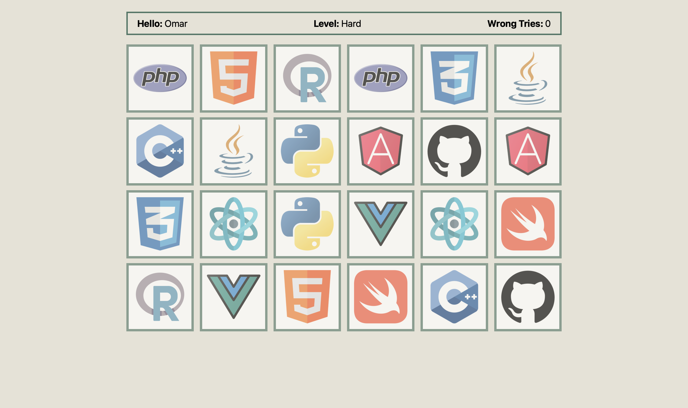

# Memory Card Game

A responsive memory card game built using HTML, CSS, and JavaScript. Players can select their name, choose a difficulty level, and match card pairs with as few mistakes as possible. The game offers dynamic grid layouts and gameplay for different difficulty levels.

## Features

- **Splash Screen**: Initial screen to enter the player's name and choose the difficulty level (Easy, Medium, Hard).
- **Three Difficulty Levels**:
  - **Easy**: 6 pairs of cards.
  - **Medium**: 10 pairs of cards.
  - **Hard**: 12 pairs of cards.
- **Game Screen**: Displays player's name, selected level, wrong tries, and the game board.
- **Countdown Timer**: A countdown before the cards are flipped.
- **Audio Feedback**: Audio plays for successful and unsuccessful matches.
- **Result Screen**: Displays the result based on the player's performance after all pairs are matched.
- **Dynamic Grid Layout**: The grid adjusts according to the difficulty level, providing a responsive design for various screen sizes.
- **Animations**: Cards flip with animations, and a result window with animations appears at the end of the game.

## Game Flow

1. **Splash Screen**: Enter your name (optional), select a difficulty level, and click the 'Start Game' button.
2. **Countdown**: A countdown appears to prepare you before the game starts.
3. **Game Board**: Cards are shown for a brief moment, then flipped over. Match pairs by clicking on cards.
4. **Match or Miss**:
   - If you match a pair, the cards remain flipped, and a success sound plays.
   - If you miss, the cards flip back, and an error sound plays. The number of wrong tries is incremented.
5. **Game End**: Once all pairs are matched, a result screen appears based on your performance.

## Images from the project

